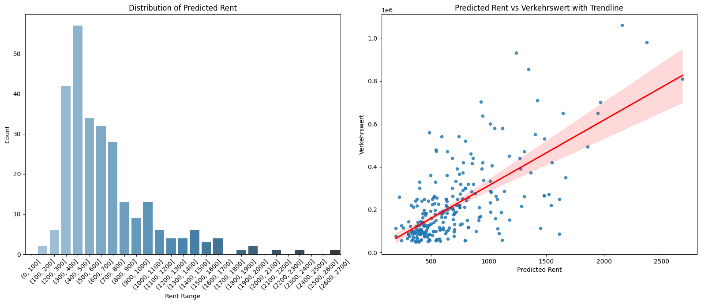

# German Foreclosure Auction Ranking

This project, developed in Python 3.12, focuses on ranking German foreclosure auctions by affordability. It combines web scraping, machine learning and large language models to process and analyze unstructured data, primarily from PDFs, to predict rental prices for auctioned properties and assess their affordability by estimating the rental duration required to break even with the purchase price.

## Table of Contents
- [German Foreclosure Auction Ranking](#german-foreclosure-auction-ranking)
  - [Table of Contents](#table-of-contents)
  - [Key Objectives](#key-objectives)
  - [Project Structure](#project-structure)
  - [Extraction Pipeline](#extraction-pipeline)
  - [Extracting Information from PDFs with LLMs](#extracting-information-from-pdfs-with-llms)
    - [Evaluated Models and Results](#evaluated-models-and-results)
    - [Few-Shot Learning](#few-shot-learning)
  - [Dataset Analysis](#dataset-analysis)
    - [The Dataset](#the-dataset)
    - [Nationwide Foreclosures](#nationwide-foreclosures)
    - [Apartment Foreclosures](#apartment-foreclosures)
    - [Price Correlations](#price-correlations)
  - [Predicting Rent Prices](#predicting-rent-prices)
    - [Training the Model](#training-the-model)
  - [Evaluation of Rent Predictions](#evaluation-of-rent-predictions)
  - [Summary](#summary)

## Key Objectives
1. **Data Collection**: Scrape foreclosure data from the official German website of the Justizministerium, where most of the information is unstructured and contained within PDFs.
2. **Data Extraction**: Utilize LLMs to extract relevant details from the PDFs.
3. **Model Training**: Train a machine learning model to predict rental prices for properties in Germany using the Kaggle dataset ["Apartment Rental Offers in Germany"](https://www.kaggle.com/datasets/corrieaar/apartment-rental-offers-in-germany).
4. **Predictions and Analysis**: Predict rental prices for foreclosure properties and evaluate affordability by calculating the break even point based on user preferences.

## Project Structure  
The project is organized into two main sections:  
1. **[Experimentation](experiments/)**:  
   - Testing and evaluating different tools, libraries, techniques and LLMs for structured data extraction.  

2. **[Core Workflow](code/)**:  
   - **[Scrape](code/scrape.ipynb)**: Collect foreclosure data and save it into an SQLite database (`foreclosures.db`).  
   - **[Extract](code/extract.ipynb)**: Extract more detailed information from the offical announcement in structured form with LLMs.
   - **[Clean](code/clean.ipynb)**: Process the scraped data from the database and save it as a CSV file (`data/zwangsversteigerungen.csv`).  
   - **[Analyze](code/analyze.ipynb)**: Compare the cleaned foreclosure dataset with the German rent dataset. This step evaluates the suitability of using the rent dataset for prediction.  
   - **[Model](code/model.ipynb)**: Train the a model using the German rental data, apply it to the foreclosure dataset and generate rental price predictions.  
   - **[Evaluation](code/model.ipynb)**: Assess the predictions by analyzing which foreclosure properties are the most affordable relative to their rental market value. 

## Extraction Pipeline  

The extraction pipeline processes foreclosure auction data from German courts, focusing on gathering, refining and structuring relevant information. The central portal for this process is the [ZVG Portal](https://www.zvg-portal.de/index.php?button=Suchen&all=1), which provides comprehensive listings for foreclosure auctions across Germany.

1. **Understanding the Structure of Data**:  
   - Germany is divided into federal states.  
   - Each state contains districts (`Kreise`) and within each district is at least one local court (`Amtsgericht`) responsible for conducting foreclosure auctions (`Zwangsversteigerungen`).  
   - Listings from these courts are uploaded to the ZVG Portal, often accompanied by documents like exposes and appraisals (`Gutachten`).  

2. **Scraping the ZVG Portal**:  
   - Collect detailed foreclosure data directly from the ZVG website.  
   - Save the scraped data into an SQLite database (`foreclosures.db/foreclosure_data`).  

3. **Downloading PDFs**:  
   - Retrieve the official announcement PDF from the ZVG Portal, which contain additional insights about the properties.  

4. **Extracting Information from PDFs**:  
   - Use a PDF extraction library to process the documents.  
   - Employ LLMs to convert the extracted content into a structured format.  
   - Save the processed and structured data into a separate table in the database (`foreclosures.db/foreclosureobjects_data`).  

5. **Data Integration**:  
   - Merge the original scraped data with the newly structured data.  
   - Build a DataFrame that combines information from both data sources (`data/zwangsversteigerungen.csv`).   

## Extracting Information from PDFs with LLMs

As this project focuses heavily on extracting structured information, the methodology needs its own detailed discussion. We explored two primary techniques for leveraging large language models in this process: **guided generation** and **restricted generation**. 

- **Guided Generation**: In this approach, the LLM is guided through a prompt explicitly defining the expected schema. The output is not restricted in terms of the tokens the model can generate, allowing for flexibility. This method works well with larger models like ChatGPT 4o but often fails with smaller local models.
- **Restricted Generation**: Here, the tokens available for the models output are explicitly restricted to predefined options. While this can improve accuracy for specific tasks, it may limit the models ability to handle complex or nuanced inputs.

We decided to use a **local LLM** for extraction. Despite the theoretical savings, the electricity costs likely surpassed or came close to the expenses of using the ChatGPT API. For our **generation prompt**, we supplied the official announcement (`amtliche Bekanntmachung`) PDF, a target schema for generation and a few examples to enhance in-context understanding.

### Evaluated Models and Results
We tested several models for information extraction. The results varied significantly based on the model used, as shown below:

| **Model**                               | **Performance**                                                                                          |
|-----------------------------------------|----------------------------------------------------------------------------------------------------------|
| **Llama 3.2 (3B)**                      | Poor results; generation time ~20 seconds.                                                               |
| **Meta-Llama 3.1 (8B)**                 | Excellent results; generation time ~40 seconds.                                                          |
| **Mistral-Nemo (12.2B)**                | Excellent results; extremely slow (~3 minutes).                                                          |
| **Mistral (7B)**                        | Mediocre results; similar speed to Llama 3.1 (~40 seconds).                                              |
| **Mistral-NeMo-Minitron (8B)**          | Excellent results; generation time ~1.20 minute (faster with smaller quantizations but worse results).   |
| **Gemma 2 (9B)**                        | Failed to generate valid JSON output.                                                                    |

Ultimately, **Llama 3.1 (8B)** was selected for its balance of performance and efficiency.

### Few-Shot Learning
While we considered fine-tuning the model due to the structured nature of foreclosure announcements (e.g., tabular data), we chose **in-context learning** with few-shot examples. This approach was simpler to implement and significantly improved the accuracy of the extracted content. We tested various few-shot configurations with Llama 3.1, yielding the following results for 10 randomly selected PDFs:

| **Column**             | **0-shot** | **1-shot** | **3-shot** | **5-shot** | **Ground Truth Nulls** | **Notes**                                                 |
|------------------------|------------|------------|------------|------------|------------------------|-----------------------------------------------------------|
| Flaeche                | 7          | 10         | 8          | 7          | 0                      |                                                           |
| Typ                    | 7          | 7          | 7          | 9          | 0                      | Some misclassified examples.                              |
| Baujahr                | 10         | 10         | 9          | 10         | 4                      |                                                           |
| Heizsystem             | 3          | 10         | 10         | 10         | 9                      | Rare; will be excluded.                                   |
| Anzahl Räume           | 4          | 6          | 6          | 9          | 5                      | Some misclassified examples.                              |
| Raum_Typen             | 3          | 6          | 8          | 8          | 0                      |                                                           |
| Balkon                 | 8          | 9          | 10         | 10         | 0                      |                                                           |
| Garten                 | 9          | 9          | 9          | 10         | 0                      | False positives in most settings except 0-shot and 5-shot.|
| Verkehrswert           | 9          | 10         | 10         | 10         | 0                      |                                                           |
| Gesamtverkehrswert     | 10         | 10         | 10         | 10         | 0                      |                                                           |
| Anzahl_Objekte         | 10         | 10         | 10         | 10         | 0                      |                                                           |

This evaluation shows that **1-shot and 5-shot setups** performed best, depending on the specific column and data complexity. 
We decided to use **5-Shot** for the extraction.

##  Dataset Analysis  
The final dataset offers an overview of foreclosure auctions across Germany. We will look at key insights about the distribution, characteristics and pricing trends of auctioned apartments. The final dataset provides valuable insights into Germany’s foreclosure market. Key findings include:  
1. **Regional Disparities**: Variations in foreclosure activity across federal states, with Berlin and Nordrhein-Westfalen as hotspots for apartment foreclosures.  
2. **Apartment Characteristics**: The majority of auctioned apartments are small to medium in size, reflecting typical urban housing.  
3. **Property Value Trends**: Higher property values are concentrated in urban centers like Berlin and in southern states.  

### The Dataset
The final dataset is a detailed compilation of foreclosure data gathered from the ZVG portal and additional information extracted from offical announcements. Key features include property details such as area, market value, type, year of construction, number of rooms, and location. These attributes are combined with metadata like auction dates and official case numbers.  

| **Column Name**              | **Description**                                                                                               | **LLM-Extracted**  |
|------------------------------|---------------------------------------------------------------------------------------------------------------|--------------------|
| `foreclosurecase_link`       | URL to the specific foreclosure case announcement on the ZVG portal.                                          | No                 |
| `flaeche`                    | Area of the property in square meters (m²).                                                                   | Yes                |
| `verkehrswert`               | Market value (`Verkehrswert`) of the property in euros.                                                       | Yes                |
| `typ`                        | Property type, e.g., "Wohnung" (apartment), "Haus" (house).                                                   | Yes                |
| `baujahr`                    | Year of construction for the property.                                                                        | Yes                |
| `raeume`                     | Number of rooms in the property.                                                                              | Yes                |
| `raum_typen`                 | Types of rooms, e.g., living room, kitchen, bathroom.                                                         | Yes                |
| `balkon`                     | Indicates whether the property has a balcony (`True`/`False`).                                                | Yes                |
| `garten`                     | Indicates whether the property has a garden (`True`/`False`).                                                 | Yes                |
| `objekt_lage`                | General location of the property.                                                                             | No                 |
| `aktenzeichen`               | Official case number of the foreclosure.                                                                      | No                 |
| `termin`                     | Scheduled auction date for the property with location.                                                        | No                 |
| `art_der_versteigerung`      | Type of foreclosure auction, provided by the portal.                                                          | No                 |
| `beschreibung`               | General description of the property, as provided in the announcement.                                         | No                 |
| `bundesland_name`            | Federal state where the property is located.                                                                  | No                 |  

While the official announcements provide essential information, exposés often include critical details not available elsewhere, such as the property's condition, detailed room descriptions. These factors are particularly important for predicting rent prices.  
However, processing exposés presents challenges. These documents are typically lengthy (10–50 pages) and contain irrelevant data that can dilute the quality of extracted information. Additionally, the computational cost of processing such large documents with LLMs is significant larger and results can suffer when the input context is cluttered with unnecessary details.  
To improve ur system, preprocessing pipelines could be used to extract relevant sections of exposés, such as property descriptions and condition details, before LLM analysis. Dividing documents into smaller chunks based on headings or semantic segmentation can also help reduce noise and enhance extraction accuracy. 

### Nationwide Foreclosures  
A map visualizing the distribution of foreclosures across Germany effectively underscores these regional differences, providing a clear picture of the variations.  

This map highlights notable regional differences in foreclosure activity across Germany. Nordrhein-Westfalen stands out as the region with the highest number of foreclosures, which is unsurprising given its dense population and urban concentration. Interestingly, certain regions list no foreclosures on the ZVG Portal. This could mean that some federal states dont contribute to the centralized system and instead use their own websites to publish foreclosure information.

### Apartment Foreclosures

To refine the analysis, the dataset was filtered to focus exclusively on apartments meeting realistic criteria for living or investment purposes.  
The apartments included in the analysis were selected using the following conditions:  
- Property type (`typ`) is an apartment (`Wohnung`).  
- A minimum property value (`verkehrswert`) of €50,000 to exclude properties with unrealistic prices or errors in the data.  
- A maximum area (`flaeche`) of 240 m², ensuring that large-scale properties like penthouses are excluded.  
- A maximum of 10 rooms (`raeume`), filtering out unusually large or shared-living accommodations and apartment complexes.

**Regional Trends**  
The distribution of apartment foreclosures differs from general foreclosure patterns. Berlin emerges as one of the top four states with the highest number of apartment foreclosures, reflecting its dense urban population.  

**Property Values (`Verkehrswert in €`)**  
Apartments in Berlin ahve the highest median property values, followed by southern states like Bavaria. This aligns with broader housing market trends in Germany, where urban centers and southern regions typically have higher rents and property prices.  

**Size and Room Distribution**  
Most auctioned apartments are small to medium-sized, typically under 100m² with 2 to 4 rooms. This is beneficial as it mirrors the broader apartment market, where most properties share these characteristics (as is also evident in the Immo dataset, which will be used for predicting rent data).

### Price Correlations  

We will also examine how apartment features such as the number of rooms (`raeume`) and construction year (`baujahr`) relate to property value (`verkehrswert`).
Looking at these relationships is interesting because these variables are predictors in our model.

**Rooms vs. Price (`Verkehrswert in €`):**

There is a slight upward trend suggesting that apartments with more rooms generally have higher prices. However, the correlation is weak, as indicated by the following metrics:  
- **Pearson Correlation**: 0.118  
- **Spearman Correlation**: 0.114  

This weak relationship suggests that the connection may not be linear, that errors might exist in the extracted data or that the number of rooms alone is insufficient to explain property values. For instance, it seems implausible that a 10-room apartment would cost only around 200k€ unless it is in extremely poor condition or located in an undesirable area.

**Construction Year (`Baujahr`) vs. Price (`Verkehrswert in €`):**  
For the construction year, we observe a similar weak relationship and correlation as with the number of rooms:  
- **Pearson Correlation**: 0.022  
- **Spearman Correlation**: 0.235  

This lack of strong correlation could be attributed to the wide range of construction years in the dataset and the diverse conditions of the properties. Older buildings, in particular, may vary significantly in their states of preservation or renovation, which influences the relationship between construction year and property value.

## Predicting Rent Prices

To determine if our dataset is suitable for predicting apartment rent prices, we first analyzed the *price distribution* to ensure that both datasets (foreclosure data and rent data) fall within the same price segments. We applied the same cleaning methods and assumptions about what constitutes an apartment to the rent data as we did with the foreclosure data. This step is crucial, as significant discrepancies in the price segments could lead to poor predictions. In the following density plots, we observe that the distributions of rent prices and market prices are similar, suggesting that this dataset could be suitable for prediction. This assumes that the prices are not heavily skewed and that both distributions follow the same pattern. However, if we consider that foreclosure auctions typically feature only lower-segment apartments, we must acknowledge that these may not exhibit the same distribution as the overall dataset, which introduces potential errors in our predictions for the apartment rents.

To confirm the similarity between the two datasets, we standardized the rent and market prices and created a **Q-Q plot**. The Q-Q plot further validated that both distributions are highly comparable.

One of the variables we will use to train the model is the year of construction. The following plot shows that foreclosed apartments are likely older than those available for rent. This could be due to factors such as deaths based on old age or because newer apartments are more likely to be owned by large real estate companies, while older ones may be privately owned. For our model, this suggests that it may perform better on newer apartments, as it has less training data for older apartments.

### Training the Model
We trained a model using the overlapping columns between the foreclosure and rental datasets, specifically: **regio1**, **balcony**, **baseRent**, **yearConstructed**, **noRooms**, **livingSpace**, and **garden**.

Among the tested models, the **XGBRegressor** performed the best with the following results:
- **Mean Absolute Error (MAE):** 130.03
- **Mean Squared Error (MSE):** 46,702.05

Although the MAE is relatively high, it remains acceptable for the prototypes intended purpose. One potential improvement would be to incorporate the city or district (`Kreis`) of the apartments as a feature in the model. This is feasible, as location information is available in our dataframe, though it requires cleaning. This assumption is based on the idea that the foreclosure occurs in the same city where the apartment is located.

The following density plot shows that the model tends to overpredict prices for apartments. Additionally, the scatter plot demonstrates that as the actual apartment price increases, the model's predictions become less precise. This suggests that the current features may not fully capture the variations in apartment prices, particularly at the higher end of the market.

Despite these limitations, the results are satisfactory for the prototype. Future work could involve further refinements, such as incorporating the Kreis or property condition as additional features.

## Evaluation of Rent Predictions

To evaluate and rank the different foreclosure apartments, we imputed values for missing rows and then predicted the rent for each apartment. Our analysis revealed that most of the apartments fall into the mid-range for rent prices. We observed a strong correlation between the market value (`Verkehrswert`) and the predicted rent, where higher Verkehrswert apartments tend to have higher rent prices, as illustrated in the plot.

Next, we examined how long it would take to break even based on the market value for each apartment, excluding the appreciation in property value. This calculation was performed under two scenarios: one where no loan is used and one where a loan is taken. Users can input their **base capital**, **monthly loan payment**, and **interest rate** for the loan. Additionally we assume that the loan will be repaid using 90 % of the rent generated from the apartment (the other 10 % are saved for ongoing costs). Our results showed that for most apartments the break-even point falls between **200 to 400 months**, which equals roughly **16 to 32 years**. 

When a loan is involved, significantly more money is required and in some cases the loan may never be fully paid off (these instances were excluded from the plots). Additionally, the more expensive an apartment is, the lower the rent and the higher the loan the more money is spent on the loan over time. This is self-explanatory but explains why the number of apartments displayed with a loan is generally lower than without a loan.

To further evaluate the prototype, we assumed a person has **50,000 €** in savings and is willing to pay **500 €** monthly toward the loan with an interest rate of **7 % per year**. Based on these assumptions, the most favorable foreclosure apartment, without imputed values is:

- **Apartment Link:** [Foreclosure Case Link](https://www.zvg-portal.de/index.php?button=showZvg&zvg_id=162923&land_abk=nw)
- **Aktenzeichen:** 0005 K 0121/ 2022
- **Bundesland:** Nordrhein-Westfalen
- **Area (m²):** 114
- **Market Value:** 58,000 €
- **Year Built:** 1895
- **Predicted Rent:** 1,115.61 €
- **Monthly Loan Payment:** 1,504.05 €
- **Loan Duration:** 5.42 months
- **Total Loan Payment:** 8,150.42 €
- **Total Money Spent:** 58,150.42 €
- **Break-Even Point:** 57.92 months (approximately 4.8 years)

At first glance, this appears to be a solid investment. However, there is currently someone living in this apartment and the actual rent is only around 600 € and the apartment has several issues, such as a moldy basement. The property's value is also expected to decrease due to a negative trend in the [local real estate market](https://www.zvg-portal.de/index.php?button=showAnhang&land_abk=nw&file_id=360602&zvg_id=162923). The apartment would be more attractive if no existing rental contracts were in place, as this would allow the possibility of raising the rent. Without this flexibility, breaking even would take around 93 months (7.75 years). While this is acceptable for real estate investments, it should be considered in light of the property's age and potential need for renovation. We wouldn't invest into this apartment.

Lastly, we analyzed another apartment in Berlin, which is the first property where the ranking is higher with a loan than without. This doesn't imply that the break-even point occurs sooner with a loan compared to purchasing the apartment without one. It simply means that, when compared to another apartment purchased without a loan, the break-even point is reached earlier in this case. This occurs when the property’s market value is high, as it results in a higher loan and higher interest payments.
For this apartment, the details are as follows:

- **Apartment Link:** [Foreclosure Case Link](https://www.zvg-portal.de/index.php?button=showZvg&zvg_id=13732&land_abk=be)
- **Aktenzeichen:** 0070 K 0033/ 2022
- **Bundesland:** Berlin
- **Area (m²):** 31
- **Market Value:** 56,000 €
- **Year Built:** 1900
- **Predicted Rent:** 540.67 €
- **Monthly Loan Payment:** 986.61 €
- **Loan Duration:** 6.2 months
- **Total Loan Payment:** 6,126.81 €
- **Total Money Spent:** 56,126.81 €
- **Break-Even Point:** 115.34 months (approximately 9.6 years)

Unfortunately, the LLM incorrectly extracted the market value. The official announcement lists the same apartment twice and then sums the price for some reason.

The apartment is currently rented out for 238.00 €, which is low for Berlin, equating to 7.68 €/m². The average price in Wilmersdorf, where the apartment is located, ranges from 17.27 € to 31 €/m². Given this, the predicted rent price seems reasonable.  
If we assume the apartment is rented to the same tenant and the loan is paid based on the market value, it would take 118 months (around 10 years) to pay off the loan. The break-even point would be reached after 627 months, which is roughly 52 years.  
This investment still seems solid, provided that property values do not decline. I would expect the value of the apartment to either increase or remain stable over time. If we can find a new tenant willing to pay the standard 17.27 €/m², this would make the investment very promising. However, this may be challenging due to tenant rights. This situation makes it more difficult to increase rent in some cases, potentially limiting the investment's profitability.

## Summary
Overall, it can be said that the prototype is not perfect and there are several areas for improvement, such as considering a more precise location of the properties or the condition of the properties. However, the tool provides a good initial overview of which properties might be worth considering.  
That said, it is advisable to review the appraisals, exposes and other documents of these properties personally to assess whether they are truly worth purchasing.   
The project could benefit significantly from enhanced information extraction, such as using a more advanced LLM like ChatGPT-4 or by categorizing the paragraphs based on property features and then extracting the relevant information. This could further improve the tools accuracy and usefulness.